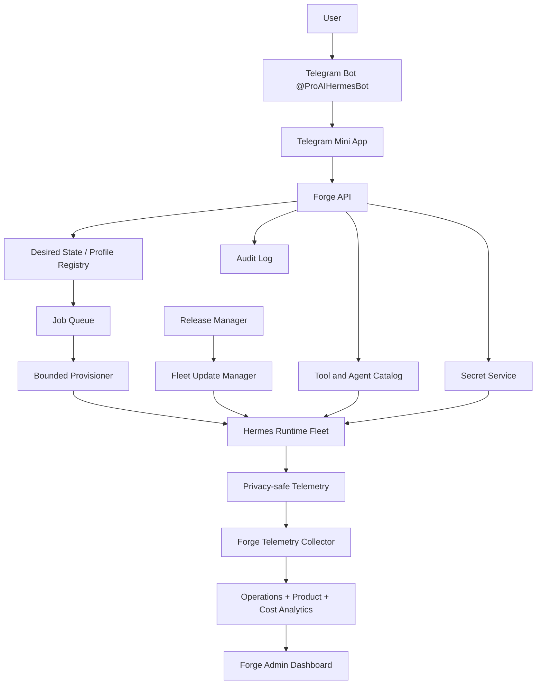

# Hermes Forge System Blueprint

**Status:** canonical system architecture
**Version:** 0.1
**Date:** 2026-09-09

This document unifies the Hermes Forge product, control plane, tenant runtime, provisioning, secrets, tools, updates, telemetry, analytics and future marketplace into one operating system.

## 1. System definition

Hermes Forge is the control plane and factory for personal and specialized AI employees.

The product is intentionally split into four layers:

1. **Telegram Bot = entry and notifications.**
2. **Telegram Mini App = user interface.**
3. **Hermes Forge Control Plane = desired state, security and lifecycle management.**
4. **Hermes Runtime = execution of real work.**

The user should never need SSH, systemd, YAML, `.env`, PostgreSQL administration or manual runtime deployment.

The core product loop is:

`Hire -> Provision -> Connect -> Verify -> Work -> Observe -> Update -> Improve`.
## 2. Unified architecture



The public UI never performs privileged host operations directly. All lifecycle changes pass through desired state and bounded jobs.
## 3. Core operating model

Hermes Forge is built around two reconciliation loops.

### 3.1 Desired-state loop

The control plane stores what each Hermes **should** look like:

- owner and Telegram bot binding;
- lifecycle state;
- runtime release and update channel;
- Agent Package and package version;
- model policy;
- enabled memory layers;
- installed tools and integrations;
- permission policy;
- connection status metadata.

The Provisioner compares desired state with actual state and applies only bounded operations until they converge.

### 3.2 Fleet-health loop

The platform continuously compares actual runtime health, release version and integration state against policy.

It can:

- detect drift;
- schedule safe upgrades;
- pause a rollout;
- rollback a broken release;
- mark a tenant degraded;
- raise an operator alert;
- expose actionable status to the owner.
## 4. Component map

| Component | Responsibility | Must not do |
|---|---|---|
| Telegram Bot | onboarding, approvals, alerts, deep links | store secrets or become full settings UI |
| Telegram Mini App | owner-facing control panel | execute shell/systemd directly |
| Forge API | tenant-scoped control-plane contract | expose raw secrets |
| Desired State Registry | canonical configuration intent | store secret values |
| Secret Service | write/test/replace/delete tenant secrets | return stored secret values |
| Provisioner | bounded privileged host operations | accept arbitrary shell from users |
| Release Manager | build/register verified immutable releases | mutate live shared runtime in place |
| Fleet Update Manager | staged rollout and rollback | deploy to all tenants blindly |
| Telemetry Collector | receive privacy-safe operational events | ingest message content or tool payloads |
| Analytics | product, reliability and unit economics | become execution dependency |
| Tool Catalog | declarative installable capabilities | contain private tenant state |
| Agent Package Registry | versioned AI employee definitions | hard-code one customer identity |
| Hermes Runtime | execute work for one tenant | administer fleet/control plane |

## 5. User surfaces

The owner-facing Mini App starts deliberately small:

1. **My Hermes** - identity, status, versions, model, memory, last activity and controls.
2. **Connections** - Maton, Google, Telegram Business, CRM, GitHub, Supabase and other integrations.
3. **Secrets** - masked existence/status plus Test, Replace and Delete.
4. **Tools** - installable capabilities and their health.
5. **Status** - runtime, integrations and update state.
## 6. Primary lifecycle: Hire to Working Hermes

The existing `@ProAIHermesBot` remains the entry point.

```text
User opens Forge
-> chooses Hire AI Employee
-> enters child bot name and username in chat
-> presses Confirm Hire
-> Telegram creates the client-owned Managed Bot
-> Forge receives managed_bot
-> Forge stores bot binding and protected token
-> HermesInstance desired state is created
-> Provisioner creates tenant resources
-> Agent Package is installed
-> runtime starts
-> health verification runs
-> status becomes HEALTHY
-> Mini App opens the control panel
-> user sends the first real task
```

A clean new customer must reach `HEALTHY` without operator SSH access.

## 7. Hermes lifecycle state machine

Canonical states:

`NEW -> BOT_BOUND -> PROVISIONING -> STARTING -> HEALTHY`

Recoverable states:

`DEGRADED`, `UPDATE_PENDING`, `UPDATING`, `PAUSED`.

Failure states:

`PROVISION_FAILED`, `UPDATE_FAILED`, `HEALTH_FAILED`.

Every state transition must have a machine-readable reason and an audit event.
## 8. HermesInstance desired-state contract

Each tenant has one canonical instance record. It contains references and policy, never raw secret values.

```yaml
schema_version: 1
instance_id: hermes_salavat
owner_id: tg:123456
bot_binding: salavatai_bot
lifecycle: running
runtime:
  channel: stable
  desired_release: hermes-1.5.0
package:
  id: personal-hermes
  version: 1.0.0
models:
  primary_family: gpt
  image_family: gpt-image
memory:
  passive_secretary: true
tools:
  - web-search
  - maton
permissions_profile: personal-default
```

The concrete schema can evolve, but all writes must be validated and versioned.
## 9. Provisioning subsystem

The Provisioner is a privileged worker behind a narrow job contract.

Allowed job types include:

- `create_tenant`;
- `create_database`;
- `bind_release`;
- `install_agent_package`;
- `install_tool`;
- `set_secret`;
- `delete_secret`;
- `restart_runtime`;
- `pause_runtime`;
- `health_check`;
- `upgrade_release`;
- `rollback_release`.

Each job has:

- tenant identity;
- requested operation;
- idempotency key;
- expected preconditions;
- bounded parameters;
- timeout;
- result code;
- audit reference.

Retrying a timed-out job must reconcile state, not create duplicate users, databases or services.
## 10. Secret system

Secrets are split into two ownership domains.

### Platform secrets

Managed by Pro AI infrastructure and invisible to customers. Examples: shared model gateways, shared image providers, monitoring credentials and infrastructure keys.

### Personal secrets

Owned by a specific Hermes tenant. Examples: Maton, Google, CRM, Supabase, GitHub and business APIs.

The owner-facing contract is write-only:

- `Set`;
- `Test`;
- `Replace`;
- `Delete`.

There is no `Get secret value` operation.

UI metadata may contain only bounded status such as `connected`, `healthy`, `last4` and `verified_at`.

For the MVP, the SecretStore implementation may safely inject tenant values into the existing protected `.env` layout. The API and Mini App must use a SecretStore abstraction so the backend can later move to a dedicated vault/KMS without changing product contracts.

Root on the shared VPS remains an infrastructure trust boundary; write-only product semantics do not make root cryptographically unable to read tenant files.
## 11. Tool and integration system

Every installable capability is described by a versioned manifest rather than UI-specific code.

```yaml
id: maton
name: Maton
type: mcp
requires:
  secrets:
    - MCP_MATON_API_KEY
installer:
  module: maton-onboarding
health:
  type: mcp_handshake
permissions:
  external_api: true
```

Installation flow:

`Catalog -> Install request -> Secret/OAuth requirement -> Provisioner -> Runtime reload -> Health check -> Connected`.

A capability can be installed but unhealthy. The UI must distinguish `installed`, `connected`, `healthy`, `degraded` and `disabled`.

Tool manifests are reusable by Agent Packages and direct owner installation.

## 12. Agent Package system

An Agent Package is the distributable AI employee definition:

- role/personality baseline;
- required and optional tools;
- memory policy;
- model policy;
- permission policy;
- onboarding questions;
- eval suite;
- compatibility requirements;
- package version and publisher metadata.
A package layout may be:

```text
agent-packages/personal-hermes/
  agent.yaml
  SOUL.md
  skills/
  tools/
  policies/
  evals/
  onboarding/
```

The first official package should prove clean-user onboarding before a marketplace exists.

Later trust tiers can be:

- Hermes Official;
- Verified Partner;
- Community.

## 13. Runtime and tenant isolation

Current architecture remains the baseline:

- separate Linux user per tenant;
- separate `HERMES_HOME`;
- separate systemd process;
- separate tenant PostgreSQL database/role where applicable;
- private mutable state, secrets and memory;
- shared read-only immutable releases and pinned tools.

Shared code is economical infrastructure, not shared tenant state.

A tenant must never be able to mutate the release used by another tenant.
## 14. Release and update system

The update model is Windows-like from the user's perspective but ring-based operationally.

Release path:

`GitHub -> CI -> immutable release -> Canary -> Preview -> Stable 10% -> Stable 50% -> Stable 100%`.

Update channels:

- `canary` - disposable/internal test runtime;
- `preview` - Pavel/internal testers;
- `stable` - default customer channel;
- `pinned` - temporary explicit hold on one release.

The existing `prepare_release.py` and `upgrade_profile.py` provide the low-level foundation: verified immutable releases, integrity checks, idle checks, snapshots, runtime switching, readiness validation and rollback.

The new Fleet Update Manager adds orchestration across profiles.

For each tenant it tracks:

- current release;
- desired release;
- channel;
- update eligibility;
- last attempt;
- result;
- rollback source;
- health before/after update.

Updates must wait for a safe/idle point instead of killing active work unless an explicit emergency policy says otherwise.
## 15. Rollout safety and automatic rollback

Every rollout ring has a promotion gate based on health and error budgets.

Example policy logic:

1. upgrade one canary;
2. run runtime and integration verification;
3. observe bounded telemetry for a defined window;
4. promote only if health remains inside policy;
5. pause automatically when failure/error-rate thresholds are exceeded;
6. rollback affected profiles when post-update health fails.

A broken release must not reach the rest of the fleet merely because CI was green.

The exact numerical thresholds are configuration, not hard-coded architecture.

A rollback changes program binding only. It must not overwrite newer tenant memory, secrets or user data.

## 16. Health model

`systemd active` is necessary but insufficient.

A healthy Hermes verifies at least:

- runtime process and expected release;
- Telegram connectivity/identity;
- primary LLM path;
- tenant database;
- memory query path;
- required Agent Package capabilities;
- required external integrations.

Health output is structured and privacy-safe. It returns component status and bounded reason codes, not user content.
## 17. Telemetry principles

Forge collects system behavior, not conversation content.

Existing Hermes shared metrics already provide a privacy-safe foundation for:

- task starts/finishes;
- model call counts and outcomes;
- tool-call counts;
- retries;
- duration buckets;
- execution surfaces;
- model/provider families.

The Forge extension should add bounded capability-level dimensions such as allowlisted `tool_id` or `toolset_id`, without storing arguments or results.

Never export:

- message text;
- prompts or model responses;
- tool arguments/results;
- document contents;
- secret values or OAuth tokens;
- raw URLs/queries where they can contain user content;
- arbitrary exception payloads that may contain secrets.

Telemetry failure must never block Hermes execution.
## 18. Telemetry event contract

Events are low-cardinality, structured and allowlisted. Example:

```json
{
  "event": "tool_call_finished",
  "tenant_ref": "opaque-tenant-id",
  "runtime_release": "hermes-1.5.0",
  "agent_package": "personal-hermes@1.0.0",
  "tool_id": "web-search",
  "outcome": "success",
  "duration_bucket": "1s_to_5s",
  "timestamp": "2026-09-09T18:00:00Z"
}
```

Error reasons use bounded codes such as:

- `provider_rate_limited`;
- `model_unavailable`;
- `tool_timeout`;
- `mcp_connection_failed`;
- `integration_auth_expired`;
- `database_unavailable`;
- `telegram_unavailable`;
- `release_health_failed`;
- `provisioning_failed`.

Raw stack traces remain local/restricted and require sanitization before any centralized export.
## 19. Analytics system

Forge derives three analytics views from privacy-safe telemetry.

### Operational analytics

- healthy/degraded/offline fleet counts;
- error rate by release/tool/integration;
- latency distributions;
- retry/timeout rates;
- rollout and rollback outcomes;
- provisioning failures;
- integration health.

### Product analytics

- tool usage frequency;
- installed vs actually used capabilities;
- onboarding funnel completion;
- active Hermes count;
- first-task activation;
- Agent Package adoption;
- feature retention.

### Cost analytics

- model/tool/media execution cost;
- cost per tenant;
- cost per active Hermes;
- cost per successful task;
- gross-margin inputs.

Analytics begins with PostgreSQL/aggregates while scale is moderate. A specialized analytical store is a later scaling decision, not an MVP dependency.
## 20. Admin control room

The owner Mini App and operator dashboard are separate surfaces.

The Forge operator dashboard should expose:

### Fleet

- total/healthy/degraded/offline Hermes;
- current stable release;
- version distribution;
- pending updates;
- recent rollbacks.

### Updates

- current rollout;
- ring progression;
- success/failure counts;
- paused reason;
- affected tenants;
- rollback status.

### Tools

- calls by tool/toolset;
- success rate;
- latency;
- installed vs used;
- top failure reasons.

### Integrations and errors

- connection health;
- expired/revoked auth;
- error trends by release/provider/tool;
- incident clusters.

No operator analytics screen needs conversation text to answer these questions.
## 21. Audit log

Audit log is different from product telemetry.

Audit answers **who changed control-plane state**. Telemetry answers **how the runtime behaved**.

Audit events include:

- tenant created;
- bot bound;
- secret set/tested/replaced/deleted;
- tool installed/disabled;
- permission changed;
- model policy changed;
- runtime restarted/paused;
- release rollout scheduled;
- upgrade/rollback executed;
- operator override performed.

Audit stores actor, target, action, result, timestamp and bounded metadata.

It must not store the secret value or message content that caused an action.

## 22. Permission and autonomy model

Capabilities declare consequential actions separately from read-only actions.

Canonical policy levels:

- `disabled`;
- `read_only`;
- `approval_required`;
- `autonomous`.

Owner consent remains authoritative for Telegram Business/group scope and other user-controlled external permissions.
## 23. Data ownership and storage

Storage is separated by purpose.

### Control-plane database

Stores tenant identity, desired state, lifecycle, bot metadata, package/tool references, connection status, rollout state, audit references and billing/metering metadata.

### Secret store

Stores personal secret values behind write-only product contracts. Secret values never enter control-plane tables or analytics.

### Tenant runtime state

Lives in tenant-owned private runtime directories/databases: memory, workspace, config and private plugin state.

### Telemetry store

Stores privacy-safe counters/events and aggregates. Existing local Hermes shared metrics remain a durable edge buffer.

### Release store

Contains immutable, verified runtime releases and tool/package artifacts.

No single database should casually mix secrets, conversation archives, telemetry and control-plane metadata.

## 24. Authentication

Telegram Mini App uses validated Telegram `initData` to establish the owner identity.

Forge maps that identity to tenant-scoped resources and issues a short-lived application session.

Every API operation rechecks tenant authorization server-side; client-provided tenant IDs are never trusted as authorization proof.
## 25. Security boundaries

The architecture assumes several explicit trust boundaries:

1. **Public Telegram/Mini App boundary** - untrusted client input.
2. **Forge API boundary** - authenticated, tenant-scoped control-plane operations.
3. **Provisioner boundary** - privileged host mutation through allowlisted jobs only.
4. **Tenant boundary** - private mutable runtime state separated per Linux identity/database.
5. **Release boundary** - root-owned immutable shared program code.
6. **Secret boundary** - no readback through product APIs.
7. **Telemetry boundary** - allowlisted metadata only.

Security invariants:

- no arbitrary shell from public API;
- no secrets in Git, chat, analytics or ordinary logs;
- no cross-tenant reads/writes;
- no in-place shared release mutation;
- every consequential control-plane mutation is authorized and audited;
- upgrades preserve tenant data and support rollback;
- telemetry remains optional to execution availability.

## 26. Failure handling

Every asynchronous control-plane operation ends in a durable result, not silent partial success.

Failures are classified as retryable, blocked-by-precondition, terminal or requires-operator-review.

The UI shows bounded status/reason and a safe next action rather than raw stack traces.
## 27. Incident loop

Forge should convert repeated telemetry failures into operational incidents.

Example:

`release 1.5.0 -> Maton error rate rises -> rollout policy trips -> rollout pauses -> affected tenants remain/rollback -> operator alert -> root cause fixed -> new release -> canary again`.

The system should correlate incidents by bounded dimensions such as:

- runtime release;
- Agent Package version;
- tool/integration ID;
- provider/model family;
- error code;
- execution surface.

This makes release regression detection possible without inspecting user conversations.

## 28. Billing and metering boundary

Billing is downstream from reliable metering.

Metering should attribute bounded cost/usage dimensions to tenant and package:

- model calls/tokens where safely available from provider accounting;
- image/video/media jobs;
- paid external tools;
- infrastructure allocation where useful;
- successful task counts.

Commercial packaging can later combine subscription, execution usage and marketplace commission.

Billing must not become part of the runtime execution path; billing outages must not corrupt agent state.
## 29. Existing foundation we keep

The unified system is an evolution of the live stack, not a rewrite.

Already present and reusable:

- `@ProAIHermesBot` and Telegram Bot Management Mode;
- chat-first child-bot hiring flow and `managed_bot` handling;
- deny-by-default Forge admission;
- per-client Hermes services/users/homes;
- Profile Registry and fleet snapshot;
- immutable shared releases;
- `prepare_release.py` release creation;
- `upgrade_profile.py` verified upgrade/snapshot/rollback;
- Passive Secretary and full-history recall;
- plugins/modules and shared tools;
- privacy-safe Hermes shared metrics foundation;
- GitHub source of truth and PR/CI workflow.

Major missing product layers:

- automatic new-tenant provisioning after child-bot creation;
- canonical HermesInstance desired state;
- bounded provisioning service/queue;
- Forge API and Mini App;
- Secret Service abstraction;
- Tool Manifest and Agent Package standards;
- Fleet Update Manager;
- centralized privacy-safe telemetry collector/dashboard;
- metering/billing and marketplace.
## 30. Build sequence

The implementation order is dependency-driven:

### Phase A - Factory core

1. prove current real Managed Bot E2E;
2. introduce HermesInstance desired-state schema;
3. introduce bounded Provisioner jobs;
4. automatically provision a clean tenant to `HEALTHY`.

### Phase B - Owner control plane

5. Forge API + Telegram Mini App authentication;
6. Secret Service + Maton reference integration;
7. Mini App MVP: My Hermes, Connections, Secrets;
8. real health-check and status model.

### Phase C - Platform operations

9. Tool Manifest / Catalog v1;
10. Agent Package v1;
11. Fleet Update Manager and rollout rings;
12. centralized telemetry collector + operator dashboard.

### Phase D - Product proof

13. first official Personal Hermes package;
14. 3-5 clean-user pilots;
15. measure Hire-to-Healthy, first-task activation, support touches, reliability and COGS.

### Phase E - Scale

16. billing/metering;
17. workforce dashboard;
18. additional official packages;
19. partner publishing and marketplace only after safe package lifecycle is proven.
## 31. Recommended PR train

Keep PRs independently reviewable and rollbackable.

1. `test: prove Hermes Forge managed-bot E2E`
2. `feat: add HermesInstance desired-state schema`
3. `feat: add bounded Hermes provisioner jobs`
4. `feat: auto-provision clean Hermes tenant`
5. `feat: add Forge API and Telegram Mini App auth`
6. `feat: add write-only SecretStore and Maton connection`
7. `feat: add Hermes Mini App MVP`
8. `feat: add unified Hermes health contract`
9. `feat: add tool manifest and catalog v1`
10. `feat: add Agent Package v1`
11. `feat: add fleet release channels and reconciler`
12. `feat: add privacy-safe Forge telemetry collector`
13. `feat: add Forge operator analytics dashboard`
14. `feat: add first Personal Hermes package`
15. `chore: run clean-user pilot and snapshot results`

Each PR should update tests, docs and sanitized deployment checkpoints where applicable.

## 32. MVP definition of done

Hermes Forge v0.1 is not complete when the Mini App looks finished. It is complete when a clean authorized user can:

- open the existing Forge bot;
- create their own child Managed Bot;
- receive an automatically provisioned Hermes tenant;
- reach `HEALTHY` without operator SSH;
- open Mini App;
- connect Maton through write-only secret entry;
- run health-check;
- send a real task to Hermes;
- survive a controlled runtime update and rollback test.
## 33. North-star metrics

The platform should optimize for a small number of measurable outcomes.

### Activation

- median `Hire -> HEALTHY` time;
- percentage reaching `HEALTHY` without operator intervention;
- percentage completing first successful task;
- integration connection completion rate.

### Reliability

- healthy fleet percentage;
- successful task rate;
- tool/integration success rate;
- rollback rate by release;
- mean time to detect and recover from platform regressions.

### Product value

- active Hermes per week/month;
- successful tasks per active Hermes;
- tools actually used vs installed;
- Agent Package retention/adoption.

### Economics

- COGS per active Hermes;
- COGS per successful task;
- support touches per tenant;
- gross margin by package/tier.

The primary MVP north star is **percentage of clean users reaching a working healthy Hermes without operator SSH/manual provisioning**.
## 34. What the owner experiences

The owner should perceive one coherent employee, not infrastructure components.

```text
My Hermes

Hermes Salavat
ONLINE

Bot: @salavatai_bot
Package: Personal Hermes 1.0.0
Runtime: Hermes 1.5.0 Stable
Brain: GPT family
Memory: Active
Tools: 7 installed / 7 healthy

Connections
Maton              Connected
Telegram Business  Connected
Google              Not connected
CRM                 Not connected

Last activity: 3 minutes ago
Update status: Up to date

[Open Hermes] [Check] [Restart] [Settings]
```

Infrastructure terms remain available only in advanced/operator views.

## 35. What the operator experiences

Forge operator sees the fleet, not private conversations:

`127 Hermes | 122 Healthy | 3 Degraded | 2 Offline | Stable 1.5.0 | Rollout 83% | 2 rollbacks today`.

The operator can answer: which release is bad, which tool fails, which integration is expiring, which capability is popular, what costs money and which tenants need technical attention, without reading user chat history.
## 36. Documentation hierarchy

Use these documents together without duplicating authority:

- `HERMES_FORGE_SYSTEM_BLUEPRINT.md` - **canonical system architecture and component contracts**;
- `HERMES_FORGE_WHITEPAPER.md` - product thesis, rationale, principles and deeper design discussion;
- `HERMES_FORGE_ROADMAP.md` - implementation milestones, release gates and delivery order;
- `server/PROFILE_FACTORY.md` - current reproducible client-profile provisioning contract;
- `modules/shared-runtime/README.md` - current immutable shared-runtime and upgrade mechanics.

When implementation and older prose disagree, first verify live code/state, then update the Blueprint and affected lower-level documents in the same PR.

## 37. Final system formula

```text
Telegram Bot = entry
Telegram Mini App = control UI
Forge API = product contract
Desired State = source of intent
Provisioner = controlled mutation
SecretStore = credential boundary
Tool Catalog = capabilities
Agent Packages = AI employees
Hermes Runtime Fleet = execution
Fleet Update Manager = lifecycle/version control
Telemetry = privacy-safe system signals
Analytics = product/reliability/economics intelligence
GitHub + CI = release source of truth
```

**Hermes Forge is the factory, control plane and operating system for a fleet of deployable AI employees.**
